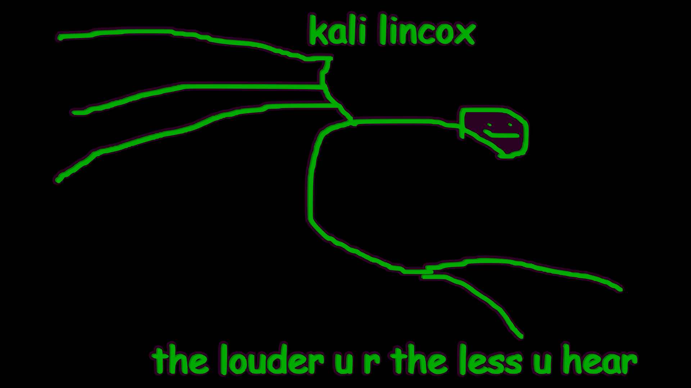

# My dotfiles for my `kali gnu/linux` dwm setup
[dwm config](https://github.com/matesz44/dwm)  
[slstatus config](https://github.com/matesz44/slstatus)  
[st config](https://github.com/matesz44/st_)  
[tabbed config](https://github.com/matesz44/tabbed)  
[other scripts](https://github.com/matesz44/scripts)  
[programs i use](https://github.com/matesz44/favtools)  
[joplin custom css](https://github.com/matesz44/joplintheme)

## And there is my desktop

### My wallpaper
  

# Whats inside this repo
- `~/.aliasrc` (make things ez cuz im lazy af)
- `~/.xinitrc` (*startx* executes these)
- `~/.vimrc_no_plugins` (my vim config (no plugins = no mess))
- `~/.vimrc` (my vim config (with plugins now))
- `~/.profile` (default shell vars for programs i use)
- `~/.bashrc` (load ~/.aliasrc)
- `~/.config/dunst/dunstrc` (fancy notifications)
- `~/.config/fontconfig/fonts.conf` (custom fonts in the system)
- `~/.config/sxhkd/sxhkdrc` (keyboard shortcuts for dwm)
- `~/.config/zathura/zathurarc` (my pdf viewer's config file)
- `~/.config/terminator/config` (terminator config file)
- `~/.tmux.conf` (tmux configuration)
- `~/.gdbinit` (download [peda](https://github.com/longld/peda) to /opt/)
